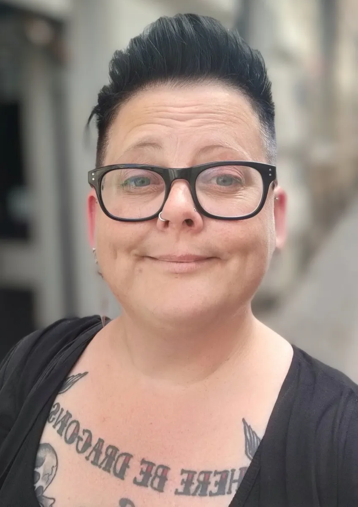
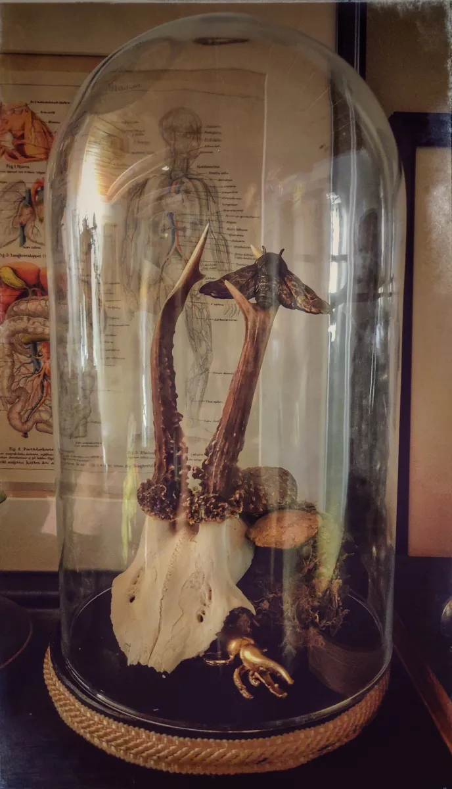
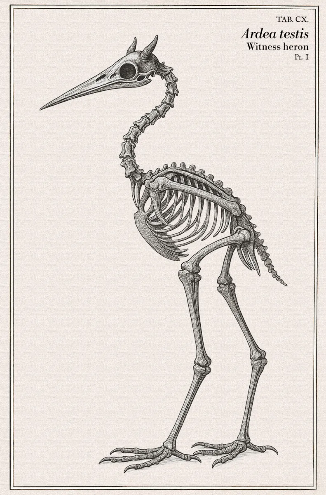
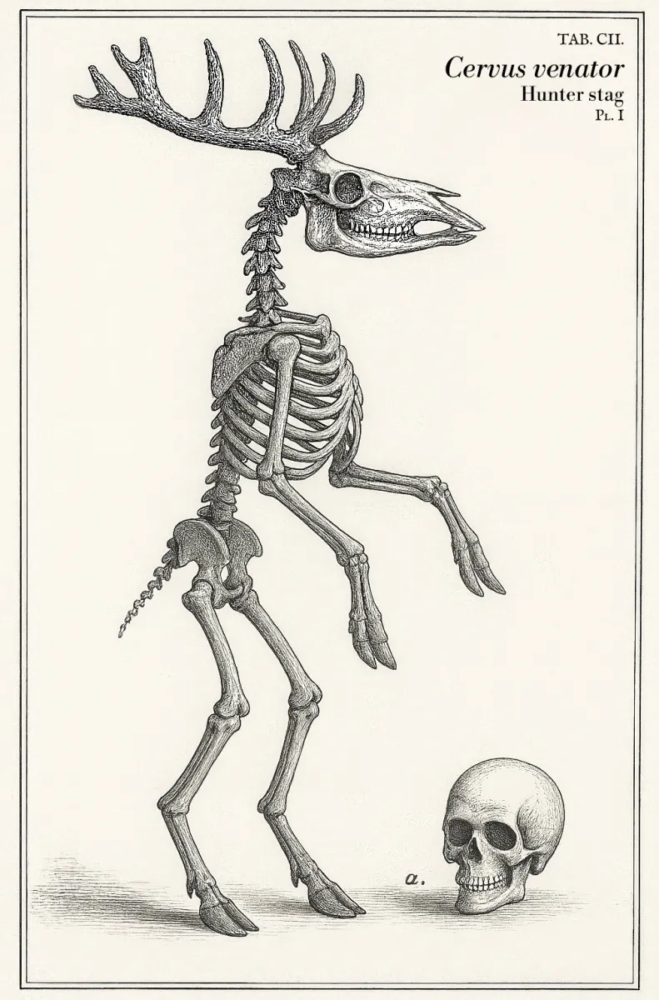

 I've been a web developer for over 14 years and it's a career I'm proud of, not least since I'm self-taught. (Shaped and battle-hardened in the trenches of open source code, lessons learned by making the mistakes! Raah! 😉) 

But the parts I was always genuinely drawn to and excited by the most weren't really about *writing code*.

It was always the planning phase: structuring data, thinking through how systems connect and where they break. Making sure the end result genuinely is usable and accessible to the people who actually are going to use it. Custom taxonomies and post types in WordPress, metadata schemas for personal data, GDPR compliance, accessibility audits. The common thread in all of it: how do you make information comprehensible, manageable, and safe?

At 42, I finally understood that I'm autistic and have ADHD (Douglas Adams had a point about that number!) and it explained *a lot*. My brain instinctively categorizes, finds patterns, and builds systems out of chaos. Taking a messy information landscape and making it structured and navigable (and keeping it so) isn't just something I *can* do; it's something I have difficulty *not* doing. That's not a personality quirk: that's an actual skill.

This self-realization has pointed me in a clearer direction. I'm looking for roles in data governance, information architecture, or administration, preferably somewhere that treats accessibility and social utility as actual priorities rather than things that happen at the end if there's time.

This site is where I think out loud about things that interest me: neurodivergence, AI, software development, and the places where they intersect in ways that aren't always obvious.

---

I also make things with my hands. Currently that means curiosity cabinet assemblages and wall plaques with 3D-printed spiders, beetles and cryptid bones. Naturalist-meets-unsettling maximalism is the aesthetic, which feels just about right.

---

[^1]: Open source software
